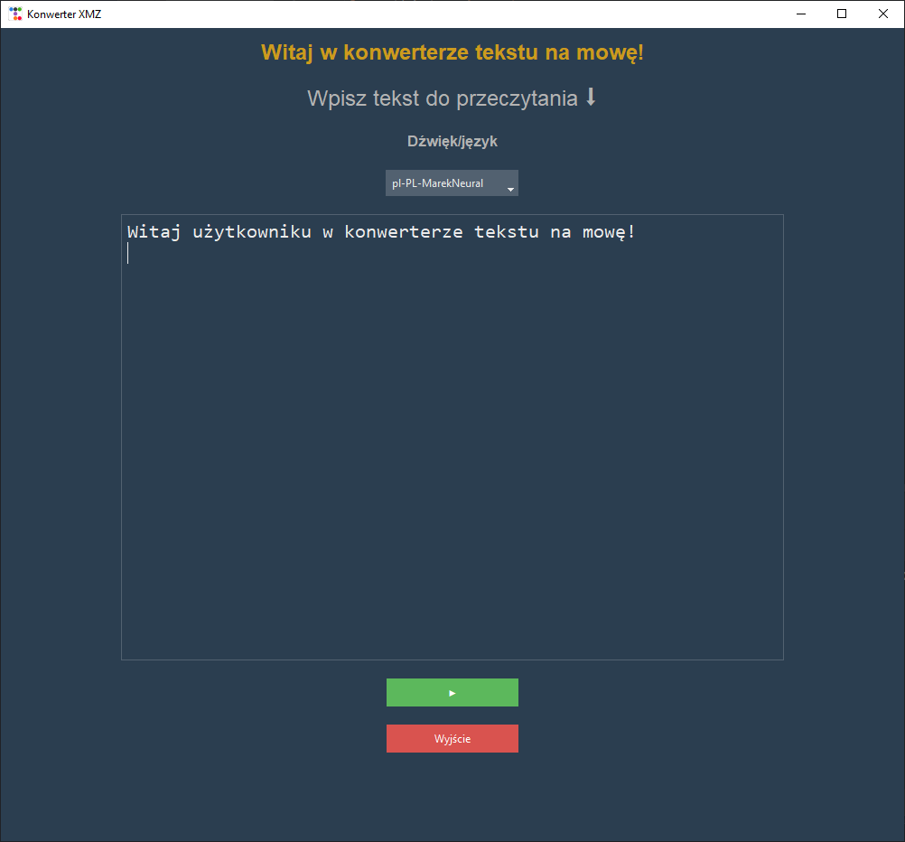
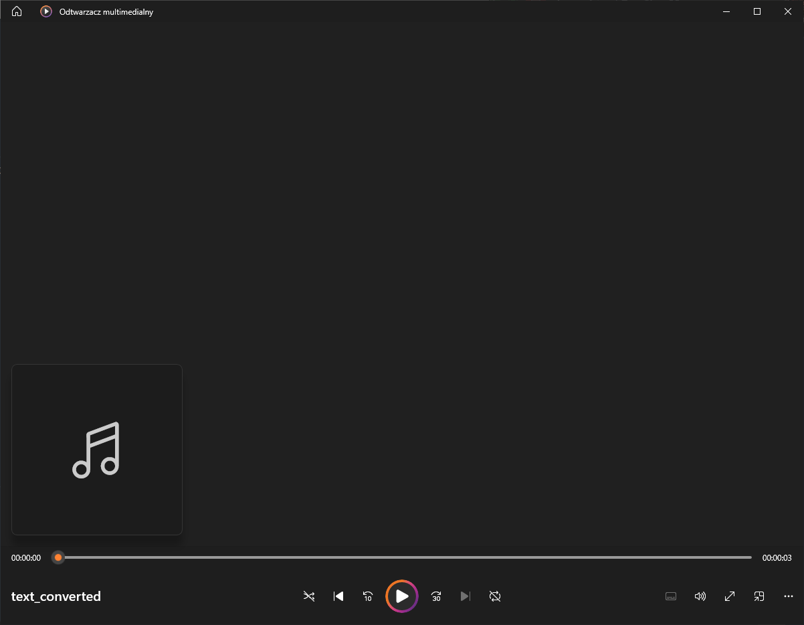
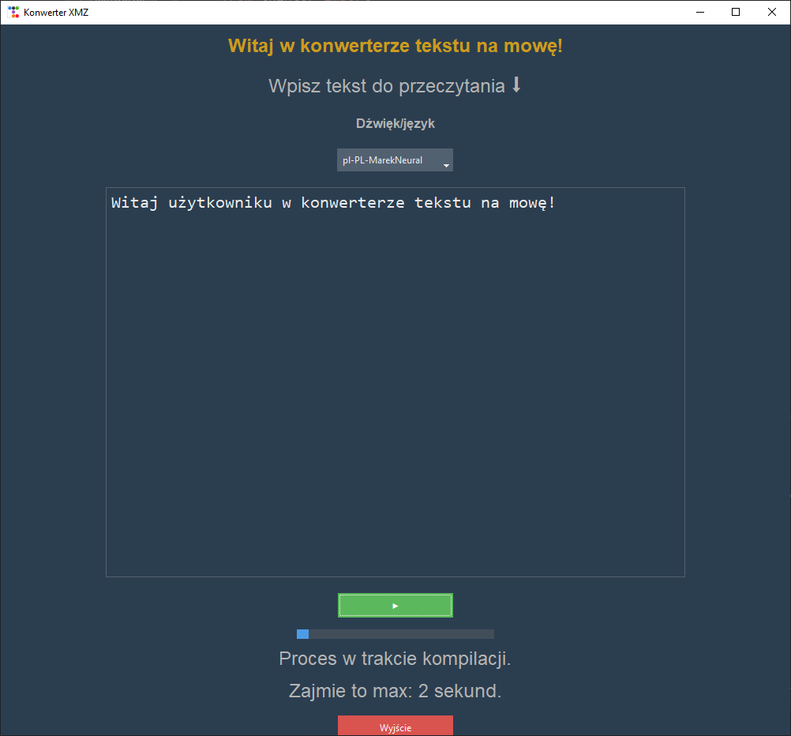

## Konwerter tekstu na mowę (Python + TTS)

Aplikacja desktopowa napisana w Pythonie, wykorzystująca bibliotekę **edge‑tts** do konwersji tekstu na mowę z użyciem neuralnych głosów Microsoft Azure. Program posiada graficzny interfejs użytkownika oparty na **tkinter + ttkbootstrap**, obsługuje wielowątkowość oraz prezentuje postęp działania w czasie rzeczywistym.

---

## Cel projektu

Celem projektu jest stworzenie funkcjonalnego narzędzia, które:

- konwertuje tekst na plik audio MP3,
- pozwala wybrać głos i język syntezy mowy,
- wyświetla przewidywany czas trwania operacji,
- pokazuje pasek postępu w trakcie generowania audio,
- automatycznie odtwarza wygenerowany plik,
- posiada przejrzysty interfejs graficzny.

Projekt prezentuje umiejętność pracy z GUI, programowaniem asynchronicznym, wielowątkowością oraz integracją z zewnętrznymi usługami TTS.

---

## Technologie

- **Python 3**
- **tkinter + ttkbootstrap** – interfejs graficzny
- **edge‑tts** – synteza mowy (Microsoft Azure Neural Voices)
- **asyncio** – obsługa asynchroniczna
- **threading** – wykonywanie TTS w tle
- **subprocess** – automatyczne odtwarzanie pliku MP3

---

## Zrzuty ekranu

### Główne okno aplikacji


*Widok głównego interfejsu aplikacji: pole tekstowe do wprowadzania treści, wybór głosu syntezy mowy, przycisk uruchamiający konwersję oraz przycisk do wyjścia z programu.*


### Odtwarzanie przekonwertowanego pliku


*Widok po wygenerowaniu pliku audio – automatyczne otwarcie domyślnego odtwarzacza po zakończeniu konwersji.*


### Pasek postępu i komunikat o czasie


*Interfejs podczas działania konwersji: aktywny pasek postępu oraz komunikat o przewidywanym czasie generowania audio.*


### Komunikat o zakończeniu pracy


*Ekran po zakończeniu konwersji: zapełniony pasek postępu oraz komunikat informujący o pomyślnym zakończeniu procesu.*


---

## Funkcjonalności aplikacji

- Wprowadzanie tekstu do konwersji.
- Wybór głosu i języka (PL/EN).
- Generowanie pliku MP3 z neuralnym TTS.
- Pasek postępu aktualizowany w czasie rzeczywistym.
- Informacja o przewidywanym czasie trwania operacji.
- Automatyczne odtwarzanie wygenerowanego pliku.
- Interfejs w stylu *superhero* (ttkbootstrap).

---

## Struktura projektu

- `main.py` – logika aplikacji i GUI  
- `edge_tts` – biblioteka odpowiedzialna za syntezę mowy  
- `threading` – wykonywanie TTS w tle  
- `asyncio` – obsługa asynchronicznego zapisu pliku  

---

## Uruchomienie

Instalacja zależności:

```bash
pip install edge-tts ttkbootstrap
```

Uruchomienie aplikacji:

```bash
python main.py
```

---

## Możliwe ulepszenia

- dodanie większej ilości głosu / języków do wyboru,
- możliwość wyboru lokalizacji zapisu,
- dodanie suwaka prędkości i wysokości głosu,
- tryb ciemny/jasny przełączany w GUI.

